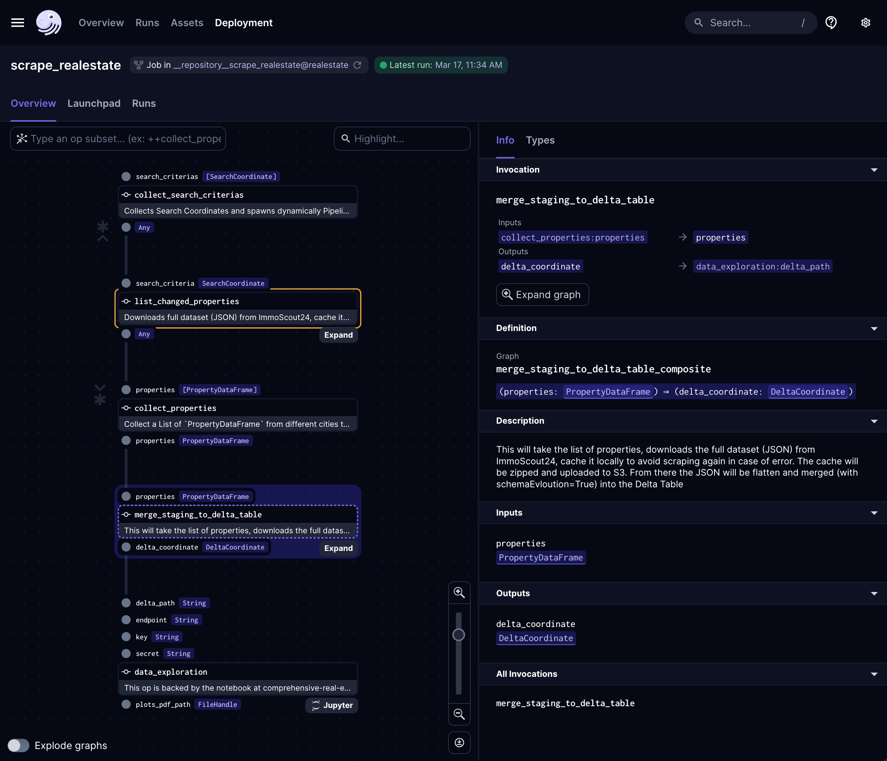

<p align="left">
<a href="https://www.ssp.sh/" target="_blank"></a>
</p>

# Practical Data Engineering: A Hands-On Real-Estate Project Guide

[](https://www.ssp.sh/blog/data-engineering-project-in-twenty-minutes/)

This repository demonstrates a **real-world Data Engineering project** that addresses common challenges while exploring innovative technologies. The project focuses on building a data application that collects real-estate data, processes it using modern tools, and delivers insights through machine learning and data visualization. It serves as both a learning resource and a practical guide for real-world applications.


**Built your own DE project or forked mine? Let me know in the comments; I'd be curious to know more about.**

## 🌟 About This Project

This Practical Data Engineering project addresses common data engineering challenges while exploring innovative technologies. It should serve as a learning project but incorporate comprehensive real-world use cases. It's a guide to building a data application that collects real-estate data, enriches it with various metrics, and offers insights through machine learning and data visualization. This application helps you find your dream properties in your area and showcases how to handle a full-fledged data engineering pipeline using modern tools and frameworks.

### Why this project?
- **Real-World Application**: Tackling a genuine problem with real estate data to find the best properties.
- **Comprehensive Tech Stack**: Utilizes a wide range of technologies from web scraping, S3 storage, data processing, machine learning, to data visualization and orchestration.
- **Hands-On Learning**: Offers a hands-on approach to understanding how different technologies integrate and complement each other in a real-world scenario.

### Key Features & Learnings:
- Scraping real estate listings with [Beautiful Soup](https://beautiful-soup-4.readthedocs.io/en/latest/index.html)
- Change Data Capture (CDC) mechanisms for efficient data updates
- Utilizing [MinIO](https://github.com/minio/minio) as an S3-Gateway for cloud-agnostic storage
- Implementing UPSERTs and ACID transactions with [Delta Lake](https://delta.io/) 
- Integrating [Jupyter Notebooks](https://github.com/jupyter/notebook) for data science tasks Visualizing data with [Apache Superset](https://github.com/apache/superset)
- Orchestrating workflows with [Dagster](https://github.com/dagster-io/dagster/)
- Deploying on [Kubernetes](https://github.com/kubernetes/kubernetes) for scalability and cloud-agnostic architecture

### Technologies, Tools, and Frameworks:
This project leverages a vast array of open-source technologies including MinIO, Spark, Delta Lake, Jupyter Notebooks, Apache Druid, Apache Superset, and Dagster—all running on Kubernetes to ensure scalability and cloud-agnostic deployment.

<p align="center">

</p>

### 🔄 Project Evolution and Updates

This project started in November 2020 as a project for me to learn and teach about data engineering. I published the entire project in March 2021 (see the initial version on [branch `v1`](https://github.com/ssp-data/practical-data-engineering/tree/v1)). Three years later, it's interesting that the tools used in this project are still used today. We always say how fast the Modern Data Stack changes, but if you choose wisely, you see that good tools will stay the time. Today, in `March 2024`, I updated the project to the latest Dagster and representative tools versions. I kept most technologies, except Apache Spark. It was a nightmare to setup locally and to work with Delta Lake SQL APi. I replaced it with [delta-rs](https://github.com/delta-io/delta-rs) direct, which is implemented in Rust and can edit and write Delta Tables directly in Python. 

Next, I might add Rill Developer to the mix to have some fun analyzing the data powered by DuckDB. For a more production-ready dashboard, Superset would still be my choice tough. 


## 🛠 Installation & Usage
Please refer to individual component directories for detailed setup and usage instructions. The project is designed to run both locally and on cloud environments, offering flexibility in deployment and testing.

### Prerequisites:
- Python and pip for installing dependencies
- MinIO running for cloud-agnostic S3 storage
- Docker Desktop & Kubernetes for running Jupyter Notebooks (optional, if you want ML capabilities)
- Basic understanding of Python and SQL for effective navigation and customization of the project

### Quick Start:

> ⚠️ **Disclaimer: For Educational Use Only**  
> This project is designed for educational purposes, demonstrating web scraping and data engineering practices. Ensure you do not violate any website's copyright or terms of service, and approach scraping responsibly and respectfully.

1. Clone this repository.
2. Install dependencies
3. Install and start MinIO
4. Explore the data with the provided Jupyter Notebooks and Superset dashboards.
```sh
#change to the pipeline directory
cd src/pipelines/real-estate

# installation
pip install -e ".[dev]"

# run minio
minio server /tmp/minio/

# create the bucket `real-estate` MinIO on 127.0.0.1:9000
# Create access key/passwords, defaults are MINIO_ROOT_USER/MINIO_ROOT_PASSWORD with default values that should work without any further configuration.

# startup dagster
dagster dev
```

## 📈 Visualizing the Pipeline




